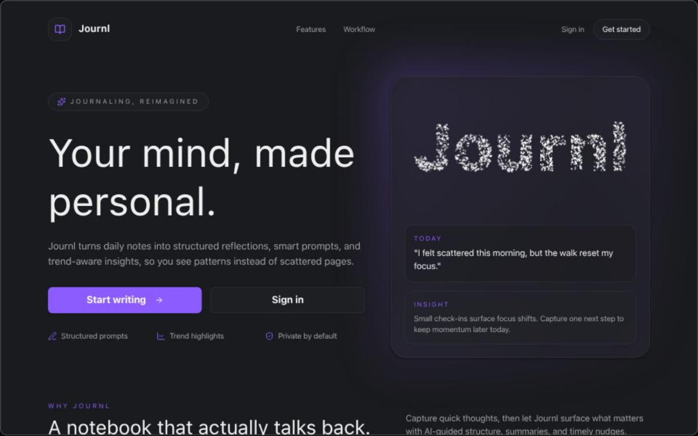

  
  <h1><a href="https://journl-snowy.vercel.app/">Journl</a></h1>

  

  Open source AI-driven journaling app that turns daily writing into structured reflection.

---

## Repository Structure

This is a monorepo powered by [Turborepo](https://turborepo.dev/) and
[pnpm](https://pnpm.io/).

- Workspace layout is defined in [`pnpm-workspace.yaml`](./pnpm-workspace.yaml).
- Shared task pipeline and env wiring live in [`turbo.json`](./turbo.json).

---

## What Lives Here

- **Web app:** [`apps/web`](./apps/web), including marketing pages,
  authenticated journaling views, API routes, and editor UI.
- **Shared packages:** [`packages`](./packages) for auth, database access,
  usage domain logic, and BlockNote integration.
- **Local dev utilities:** [`apps/drizzle-studio`](./apps/drizzle-studio) and
  [`apps/stripe`](./apps/stripe).
- **Agents & Contributor guidance:** [`AGENTS.md`](./AGENTS.md).

---

## Architecture Entry Points

Use these paths as the fastest way to understand the product and core systems.

- **App surfaces:** [`apps/web/src/app`](./apps/web/src/app)
- **Journal experience:** `apps/web/src/app/(app)/journal`
- **API routes:** [`apps/web/src/app/api`](./apps/web/src/app/api)
- **Editor integration:** [`apps/web/src/components/editor`](./apps/web/src/components/editor)
- **AI/workflow logic:** [`apps/web/src/ai`](./apps/web/src/ai) and [`apps/web/src/workflows`](./apps/web/src/workflows)
- **Auth and usage guards:** [`apps/web/src/auth`](./apps/web/src/auth) and [`apps/web/src/usage`](./apps/web/src/usage)
- **DB schema and usage domain:** [`packages/db/src/schema.ts`](./packages/db/src/schema.ts) and [`packages/db/src/usage`](./packages/db/src/usage)

---

## Development Workflow

Use the scripts in [`package.json`](./package.json) as the canonical source for
day-to-day commands.

- Install dependencies: `pnpm install`
- Start development tasks: `pnpm dev`
- Run quality gates: `pnpm check` and `pnpm typecheck`
- Build the workspace: `pnpm build`

Environment variables are loaded from a root `.env` file. See
[`turbo.json`](./turbo.json) for shared env names used by tasks.
If your local Postgres instance does not support TLS, set `POSTGRES_SSL_MODE=disable` in `.env` (default `auto` already disables SSL on loopback hosts).

For database workflows, use root scripts (`pnpm db:push`, `pnpm db:studio`) or
the dedicated utility app in [`apps/drizzle-studio`](./apps/drizzle-studio).

Content references cover both [rich linked-content previews (#291)](https://github.com/atomly/journl/issues/291)
and [durable page, journal, and block references (#292)](https://github.com/atomly/journl/issues/292).
References retain their target IDs across title changes; badges, cards, links,
and embeds are different presentations of the same relationship.

- Paste a URL into text for an inline reference, or into an empty paragraph for a card.
- Use the display menu to switch between **Inline**, **Card**, and **Link**; internal notes also support **Embed**.
  Select a regular link's text and use **Display link as** to restore its rich presentation.
- Use `/Embed note` to insert a page or journal entry. Expand the embed to read its current content.
- Select multiple blocks and use Tab/Shift+Tab to indent/outdent text, cards, and embeds together.
  Tab from a reference's action controls moves keyboard focus normally.
- Click a card background to select the whole block; drag its surface or handle to move it.
  Desktop thumbnails appear on the left and disappear cleanly if unavailable.
- Right-click a desktop block or press Shift+F10 for block actions. The drag-handle menu offers
  the same display, copy, duplicate, and delete actions. Links and selected text keep native menus;
  touch devices keep native long-press behavior and the sticky toolbar.
- Linked references load when the editor opens. The section appears only when references exist.
- Use **Explore this note** beside a note or journal heading to follow its connections. Select a note
  for its preview and linking passages; **Explore connections** follows the thread, and Back restores
  your earlier position. The sidebar **Explore** view groups connected notes and keeps unlinked notes separate.
- Public websites use page metadata when available, with URL fallback. Cards can show desktop thumbnails;
  mobile keeps the compact text presentation. Metadata fetching has bounded, cached public-network requests.

Existing saved links keep their authored display; backfill builds reference indexes
without rewriting editor content. Implementation guidelines are [Logseq block references](https://discuss.logseq.com/t/the-basics-of-logseq-block-references/8458),
[Logseq documentation](https://docs.logseq.com/), and [Obsidian internal links](https://obsidian.md/help/links).

---

## License

This project is licensed under the MIT License. See [`LICENSE`](./LICENSE).
