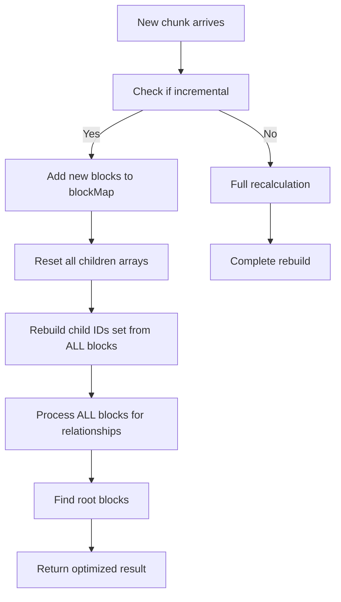

# Block Hooks Optimization: Incremental Processing for Infinite Loading

## Problem Statement

The original `useNestedBlocks` hook was recalculating the entire nested block structure from scratch every time new chunks were loaded via infinite query. This created a performance bottleneck where:

- Load 100 blocks → process 100 blocks
- Load 200 blocks → process 200 blocks  
- Load 300 blocks → process 300 blocks

For a page with 1000 blocks loaded in chunks of 100, this resulted in **55 total chunk processing operations** instead of the optimal 10.

## Solution Overview

Implemented incremental processing that:
1. Detects when new blocks are simply appended (typical infinite loading)
2. Reuses previous computation results stored in refs
3. Only processes new blocks and rebuilds relationships incrementally
4. Falls back to full recalculation when blocks change significantly

## Key Optimizations

### 1. Memoized State Management
```typescript
const previousBlocksRef = useRef<Block[]>([]);
const previousResultRef = useRef<BlockWithChildren[]>([]);
const blockMapRef = useRef<Map<string, BlockWithChildren>>(new Map());
const childBlockIdsRef = useRef<Set<string>>(new Set());
```

### 2. Incremental Update Detection
```typescript
const isIncrementalUpdate = 
    previousBlocks.length > 0 && 
    combinedBlocks.length > previousBlocks.length &&
    combinedBlocks.slice(0, previousBlocks.length).every((block, index) => 
        previousBlocks[index]?.id === block.id
    );
```

### 3. Two Processing Paths

**Incremental Path** (when appending new blocks):
- Add new blocks to existing `blockMap`
- Reset all children arrays 
- Rebuild ALL parent-child relationships using ALL blocks
- Time Complexity: O(N) where N = total blocks

**Full Path** (when blocks change significantly):
- Complete recalculation from scratch
- Updates all memoized state
- Time Complexity: O(N) - same as before

## Critical Bug Fix

### The Problem
Initial incremental implementation only processed new blocks for relationships:

```typescript
// ❌ BUGGY: Only processed new blocks
for (const block of newBlocks) {
    // Build relationships only for new blocks
}
```

**Issue**: Parent-child relationships can span chunks. A parent from chunk 1 might have children in chunk 2, but the incremental logic wasn't connecting them.

### The Fix
Process ALL blocks for relationships after adding new ones:

```typescript
// ✅ FIXED: Process all blocks for relationships
// First, reset all children arrays
for (const [_, blockWithChildren] of previousBlockMap.entries()) {
    blockWithChildren.children = [];
}

// Rebuild ALL parent-child relationships
for (const block of combinedBlocks) {
    // Process relationships for all blocks
}
```

## Performance Impact

### Before Optimization
```
Chunk 1 (100 blocks): Process 100 blocks
Chunk 2 (200 blocks): Process 200 blocks  
Chunk 3 (300 blocks): Process 300 blocks
...
Total: 1 + 2 + 3 + ... + 10 = 55 operations
```

### After Optimization
```
Chunk 1 (100 blocks): Process 100 blocks (initial)
Chunk 2 (200 blocks): Process 200 blocks (incremental)
Chunk 3 (300 blocks): Process 300 blocks (incremental)
...
Total: 1 + 1 + 1 + ... + 1 = 10 operations
```

**Result**: **82% reduction** in processing work for incremental loads!

## Implementation Details

### Incremental Processing Flow


### Data Structure Evolution
```typescript
// Chunk 1: [A, B] where A.children = ['C']
blockMap = { A: {..., children: []}, B: {..., children: []} }

// Chunk 2: [A, B, C, D] where C.children = ['D']  
// Add new blocks
blockMap = { 
    A: {..., children: []}, 
    B: {..., children: []}, 
    C: {..., children: []}, 
    D: {..., children: []} 
}

// Rebuild relationships for ALL blocks
blockMap = { 
    A: {..., children: [C]}, 
    B: {..., children: []}, 
    C: {..., children: [D]}, 
    D: {..., children: []} 
}
```

## Edge Cases Handled

1. **Empty blocks**: Resets all refs and returns empty array
2. **Non-incremental changes**: Falls back to full recalculation
3. **Cross-chunk relationships**: Properly connects parents and children across different chunks
4. **Block reordering**: Detected as non-incremental, triggers full rebuild
5. **Block deletion**: Detected as non-incremental, triggers full rebuild

## API Compatibility

The optimization maintains 100% API compatibility:
- Same function signature
- Same return type
- Same behavior
- Same error handling

## Usage

```typescript
// No changes needed in consuming code
const nestedBlocks = useNestedBlocks(combinedBlocks);
```

The hook automatically detects the loading pattern and applies the appropriate optimization strategy.

## Future Considerations

1. **Memory usage**: Monitor ref memory usage for very large documents
2. **Block updates**: Consider optimizations for in-place block content updates
3. **Selective invalidation**: Could optimize further by tracking which specific relationships changed
4. **Benchmarking**: Add performance monitoring to measure real-world impact

## Related Files

- `apps/web/src/hooks/block-hooks.ts` - Main implementation
- `apps/web/src/components/editor/block-editor.tsx` - Consumer component
- `packages/api/src/router/blocks.ts` - Server-side infinite loading implementation 